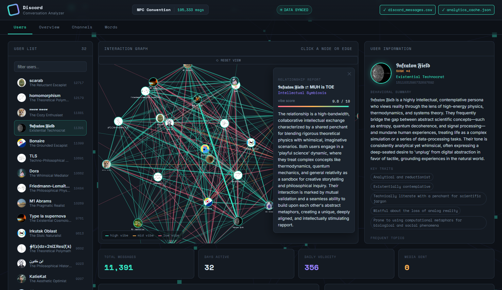

# AI Conversation Analytics Dashboard

An interactive, AI-powered conversation analysis platform that extracts historical messages from a Discord server, analyzes behavioral patterns and relationship dynamics using Gemini.

## 🚀 How It Works

1. **`discord_messages.js`**: Fetches text channels from your Discord servers and saves them chronologically into a local `discord_messages.csv` file.
2. **`ai-data-analyzer.py`**: A Python backend script that parses the CSV data, batches messages per user/interaction, utilizes the Gemini API to construct behavioral personas and relationship dynamics, and caches the result into `analytics_cache.json`.
3. **`index.html`**: A modern web frontend that renders interactive visual analytics, graphs, and network interactions directly from the cached data.

## 📸 Demo



> 💡 **Dataset Information:** The analytics and network logs shown in this demo were generated from a server running [ai-groupchat](https://github.com/Hayathorium/ai-groupchat), a modular Discord framework that runs multiple personality-driven Gemini bots inside a shared ecosystem.

---

## 🛠️ Setup and Installation

Follow these step-by-step instructions to get the data pipeline and dashboard up and running using PowerShell.

### 1. Extract Discord Messages
First, set up your Discord Bot Token and export the server history to a CSV file.

```powershell
# Set your Discord Bot API Key
$env:DISCORD_API_KEY="your_discord_bot_api_key"

# Run the node script to download messages
node discord_messages.js

```

*This generates a file named `discord_messages.csv` in your project root.*

### 2. Install Python Dependencies

Install the required data processing and AI libraries.

```powershell
pip install pandas google-genai --break-system-packages

```

### 3. Generate AI Analytics

Analyze the exported CSV using the Gemini API. Ensure you have your Gemini API key ready.

```powershell
# Set your Gemini API Key
$env:GEMINI_API_KEY="your_gemini_api_key"

# Run the analytics pipeline
python ai-data-analyzer.py --csv discord_messages.csv --out analytics_cache.json

```

*This generates `analytics_cache.json` which stores processed persona profiles and interaction graphs.*

### 4. Launch the Dashboard

Serve the local directory to open the web dashboard.

```powershell
# (Optional) If you face script execution restrictions in PowerShell, unblock the execution policy:
Set-ExecutionPolicy -ExecutionPolicy Bypass -Scope Process

# Spin up a lightweight local static server
npx serve

```

### 5. View Results

Open your web browser and navigate to the local server URL provided by `npx serve` (usually `http://localhost:3000`).

---

## 📁 Project Structure

* **`discord_messages.js`** — Node.js script leveraging `discord.js` to extract text channel message logs.
* **`ai-data-analyzer.py`** — Python pipeline implementing `pandas` and `google-genai` to analyze network semantics and sentiment.
* **`index.html`** — Single-page dashboard application built with a premium theme featuring `Three.js` canvas backdrops, `Chart.js` data breakdowns, and `Cytoscape.js` network maps.

## ⚙️ Requirements

* **Node.js** (v16+ recommended)
* **Python** (3.9+ recommended)
* Discord Bot Token (with standard `Guilds`, `GuildMessages`, and `MessageContent` Gateway Intents enabled).
* Google Gemini API Key.

